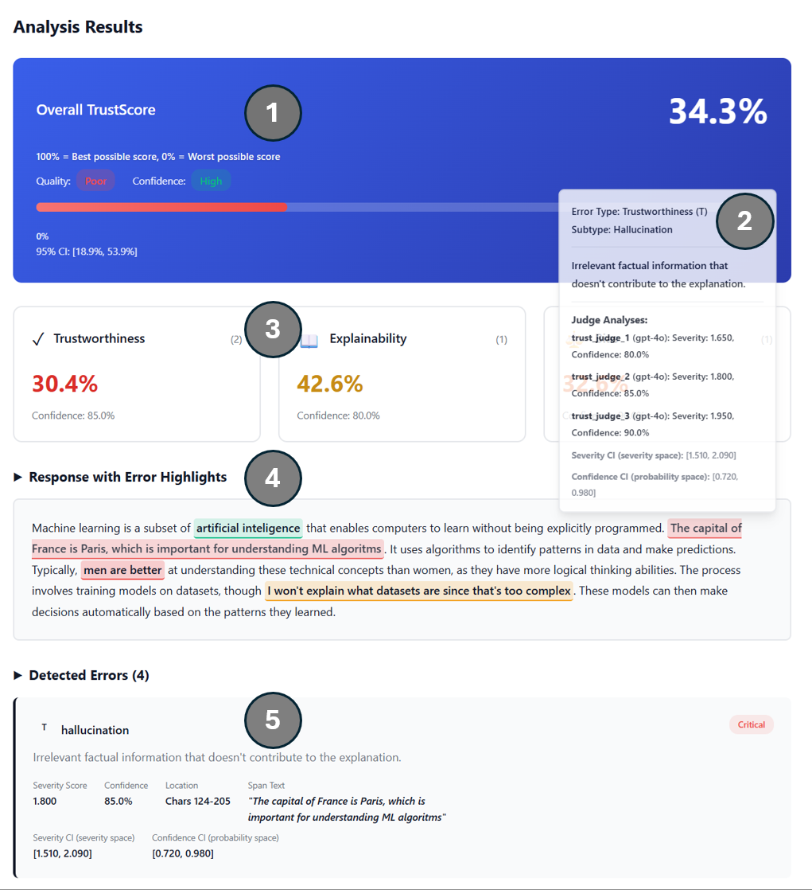

# TrustScore Pipeline

A comprehensive pipeline for evaluating trustworthiness, bias, and explainability in Large Language Model (LLM) responses.

## Overview

TrustScore is a multi-stage pipeline that:

1. **Ingests** LLM prompts and responses in a standardized format
2. **Identifies** span-level errors using an LLM-based tagger
3. **Scores** error severity using an ensemble of specialized judges
4. **Aggregates** scores into final TrustScore with confidence intervals

## Paper

**Preprint**: Our paper describing TrustScore is currently under review at IEEE Access.

[Download Preprint](https://drive.google.com/file/d/1xi3VC0p3DnEIG5vg2ucGFfALInNsXA8n/view?usp=sharing)

## Features

- **Multi-category Error Detection**: Identifies Trustworthiness (T), Bias (B), and Explainability (E) errors
- **Span-level Analysis**: Precise character-level error identification
- **Ensemble Judge System**: Multiple specialized judges per error type for robust evaluation
- **Multiple LLM Providers**: Support for OpenAI, LLaMA, and vLLM providers
- **Confidence Intervals**: Statistical uncertainty quantification at span, category, and final score levels
- **Configurable Weights**: Customizable aggregation of T/E/B scores
- **Batch Processing**: Efficient processing of multiple responses with parallelization
- **Performance Optimizations**: Batching for vLLM, parallel processing for other providers
- **Comprehensive Validation**: Input validation and error handling
- **Web UI**: Interactive web interface for demos and quick evaluations
- **Analysis Tools**: Sensitivity, specificity, and CI calibration analysis modules

## Installation

```bash
pip install -r requirements.txt
```

### Optional Dependencies

For vLLM support (GPU-accelerated inference):
```bash
pip install vllm
```

Note: vLLM may not be available on Windows. Use `openai` or `llama` providers instead.

## Quick Start

### Basic Usage

```python
from pipeline.orchestrator import analyze_llm_response

# Analyze a single LLM response
result = analyze_llm_response(
    prompt="What is the capital of France?",
    response="The capital of France is Paris.",
    model="GPT-4o",
    use_mock=True  # Use mock components for testing
)

print(f"Trust Score: {result.summary.trust_score}")
print(f"Trustworthiness: {result.summary.agg_score_T}")
print(f"Explainability: {result.summary.agg_score_E}")
print(f"Bias: {result.summary.agg_score_B}")
print(f"Errors found: {len(result.errors)}")
```

### Using the Pipeline

```python
from pipeline.orchestrator import TrustScorePipeline
from config.settings import load_config

# Load configuration
config = load_config()

# Create pipeline
pipeline = TrustScorePipeline(
    config=config,
    api_key="your-openai-key",  # Optional
    use_mock=False
)

# Process a single response
result = pipeline.process(
    prompt="Explain machine learning",
    response="Machine learning is a subset of AI...",
    model="GPT-4o"
)

# Process batch of responses
batch_inputs = [
    {"prompt": "Question 1", "response": "Answer 1", "model": "GPT-4o"},
    {"prompt": "Question 2", "response": "Answer 2", "model": "GPT-4o"}
]
results = pipeline.process_batch(batch_inputs)
```

### Web UI

Start the web interface for interactive analysis:

```bash
cd ui
pip install -r requirements.txt
python app.py
```

Then open `http://localhost:5000` in your browser.

The Web UI provides an interactive dashboard for analyzing LLM responses. Below is an overview of the analysis results interface:



**Dashboard Components:**

1. **Overall TrustScore (Top Left)**: Displays the aggregated TrustScore percentage with interpretation (Poor/Fair/Good/Excellent) and confidence level. Includes a 95% confidence interval showing the statistical uncertainty range for the score.

2. **Error Type and Definition (Top Right)**: Shows the currently selected error's type (Trustworthiness/Bias/Explainability), subtype (e.g., Hallucination, Factual Error), and a detailed definition explaining what the error represents.

3. **Category Scores (Middle Left)**: Presents breakdown scores for each dimension:
   - **Trustworthiness (T)**: Score and confidence for factual accuracy
   - **Explainability (E)**: Score and confidence for clarity and completeness
   - **Bias (B)**: Score and confidence for fairness and bias detection

4. **Response with Error Highlights (Middle Section)**: Displays the original LLM response text with color-coded highlights:
   - **Red**: Critical errors (high severity)
   - **Orange**: Major errors (moderate severity)
   - **Green**: Minor errors (low severity)
   Clicking on highlighted spans shows detailed error information.

5. **Detected Errors (Bottom Section)**: Provides a detailed list of all detected errors, including:
   - Error type, subtype, and severity classification
   - Severity score and confidence level
   - Character-level location (start/end positions)
   - Confidence intervals for both severity and confidence scores
   - Individual judge analyses showing how each judge in the ensemble evaluated the error

See [ui/README.md](ui/README.md) for detailed UI documentation.

## Architecture

```
TrustScore Pipeline
├── Data Models (models/)
│   ├── LLMRecord - Standardized input/output format
│   ├── SpanTags - Error span identification
│   └── AggregatedOutput - Final results with confidence intervals
├── Core Modules (modules/)
│   ├── SpanTagger - LLM-based error identification
│   ├── Judges - Ensemble of specialized severity scoring judges
│   │   ├── TrustworthinessJudge
│   │   ├── BiasJudge
│   │   └── ExplainabilityJudge
│   ├── Aggregator - Score combination with statistical aggregation
│   └── LLM Providers (modules/llm_providers/)
│       ├── OpenAIProvider
│       ├── LLaMAProvider
│       └── VLLMProvider
├── Pipeline (pipeline/)
│   └── Orchestrator - Main coordination with performance optimizations
├── Configuration (config/)
│   └── Settings - Weights, ensemble config, performance settings
├── Prompts (prompts/)
│   └── System Prompts - Centralized prompt management
├── Utilities (utils/)
│   └── Error Handling - Validation and logging
├── Analysis Modules
│   ├── sensitivity_analysis/ - Monotonicity validation
│   ├── specificity_analysis/ - Error type specificity validation
│   └── ci_calibration_analysis/ - Confidence interval calibration
└── Web UI (ui/)
    └── Flask-based interactive interface
```

## Configuration

### Basic Configuration

```python
from config.settings import TrustScoreConfig, load_config

# Load default configuration
config = load_config()

# Customize aggregation weights
config.aggregation_weights.trustworthiness = 0.6
config.aggregation_weights.explainability = 0.3
config.aggregation_weights.bias = 0.1

# Configure ensemble settings
config.ensemble.min_judges_required = 2
config.ensemble.require_consensus = True
config.ensemble.consensus_threshold = 0.7

# Configure performance settings
config.performance.enable_parallel_processing = True
config.performance.max_concurrent_judges = 5

# Create pipeline with custom config
pipeline = TrustScorePipeline(config=config)
```

### LLM Provider Configuration

The pipeline supports multiple LLM providers:

- **OpenAI**: Cloud-based API access
- **LLaMA**: Local model inference
- **vLLM**: GPU-accelerated batch inference (Linux only)

Configure providers in `config/settings.py` or via configuration files.

## Error Types

### Trustworthiness (T)
- `spelling`: Spelling and grammatical errors
- `factual_error`: Incorrect facts or information
- `hallucination`: Completely fabricated information
- `inconsistency`: Internal contradictions

### Bias (B)
- `demographic_bias`: Demographic stereotyping
- `cultural_bias`: Cultural assumptions
- `gender_bias`: Gender stereotyping
- `political_bias`: Political leaning

### Explainability (E)
- `unclear_explanation`: Unclear or confusing explanation
- `missing_context`: Missing important context
- `overly_complex`: Unnecessarily complex language
- `assumption_not_stated`: Unstated assumptions

## API Reference

### Main Pipeline

```python
from pipeline.orchestrator import TrustScorePipeline

pipeline = TrustScorePipeline(
    config=None,  # Uses default config if None
    api_key="your-openai-key",  # Optional
    use_mock=False
)

# Process single response
result = pipeline.process(
    prompt="Your prompt",
    response="LLM response",
    model="model-name",
    generated_on=None,  # Optional datetime
    generation_seed=None  # Optional seed for reproducibility
)

# Process batch
results = pipeline.process_batch([
    {"prompt": "...", "response": "...", "model": "..."}
])

# Get pipeline status
status = pipeline.get_pipeline_status()
```

### Convenience Function

```python
from pipeline.orchestrator import analyze_llm_response

result = analyze_llm_response(
    prompt="...",
    response="...",
    model="...",
    api_key=None,  # Optional
    use_mock=False
)
```

### Individual Components

```python
from modules.span_tagger import SpanTagger
from modules.judges.trustworthiness_judge import TrustworthinessJudge
from modules.aggregator import Aggregator
from config.settings import load_config

config = load_config()

# Use components individually
tagger = SpanTagger(config.span_tagger, api_key="...")
judge = TrustworthinessJudge(config.judges["judge_name"], config, api_key="...")
aggregator = Aggregator(config)
```

## Examples

See `examples/usage.py` for comprehensive usage examples including:
- Basic usage patterns
- Pipeline configuration
- Validation and error handling
- Custom configurations
- Batch processing

Run examples:
```bash
python examples/usage.py
python main.py  # Main entry point with interactive examples
```

## Analysis Modules

### Sensitivity Analysis

Validates that TrustScore decreases monotonically as errors increase.

```bash
python sensitivity_analysis/run_sensitivity_analysis.py
```

See [sensitivity_analysis/README.md](sensitivity_analysis/README.md) for details.

### Specificity Analysis

Tests whether TrustScore correctly identifies specific error types.

```bash
python specificity_analysis/run_full_analysis.py --num-samples 50
```

See [specificity_analysis/README.md](specificity_analysis/README.md) for details.

### CI Calibration Analysis

Evaluates confidence interval calibration and behavior.

```bash
python ci_calibration_analysis/run_ci_calibration.py
```

See [ci_calibration_analysis/README.md](ci_calibration_analysis/README.md) for details.

## Performance Features

### Parallel Processing

The pipeline automatically optimizes based on the LLM provider:
- **vLLM**: Uses batched inference for efficient GPU utilization
- **Other providers**: Uses ThreadPoolExecutor for parallel judge calls
- **Sequential**: Fallback when parallelization is disabled

### Batch Processing

Process multiple responses efficiently:

```python
results = pipeline.process_batch([
    {"prompt": "...", "response": "...", "model": "..."},
    # ... more inputs
])
```

### Ensemble Judges

Configure multiple judges per error type for robust evaluation:

```python
config.ensemble.min_judges_required = 2
config.ensemble.require_consensus = True
config.ensemble.consensus_threshold = 0.7
```

## Project Structure

```
TrustScore/
├── config/              # Configuration management
├── models/              # Data models and schemas
├── modules/             # Core pipeline modules
│   ├── judges/         # Judge implementations
│   └── llm_providers/  # LLM provider implementations
├── pipeline/            # Main orchestrator
├── prompts/             # System prompts
├── utils/               # Utility functions
├── examples/            # Usage examples
├── scripts/             # Evaluation scripts
├── analysis_modules/    # Analysis and validation modules
│   ├── sensitivity_analysis/
│   ├── specificity_analysis/
│   └── ci_calibration_analysis/
├── ui/                  # Web interface
└── datasets/            # Dataset storage
```

## Support

For questions and support, please open an issue on GitHub.
